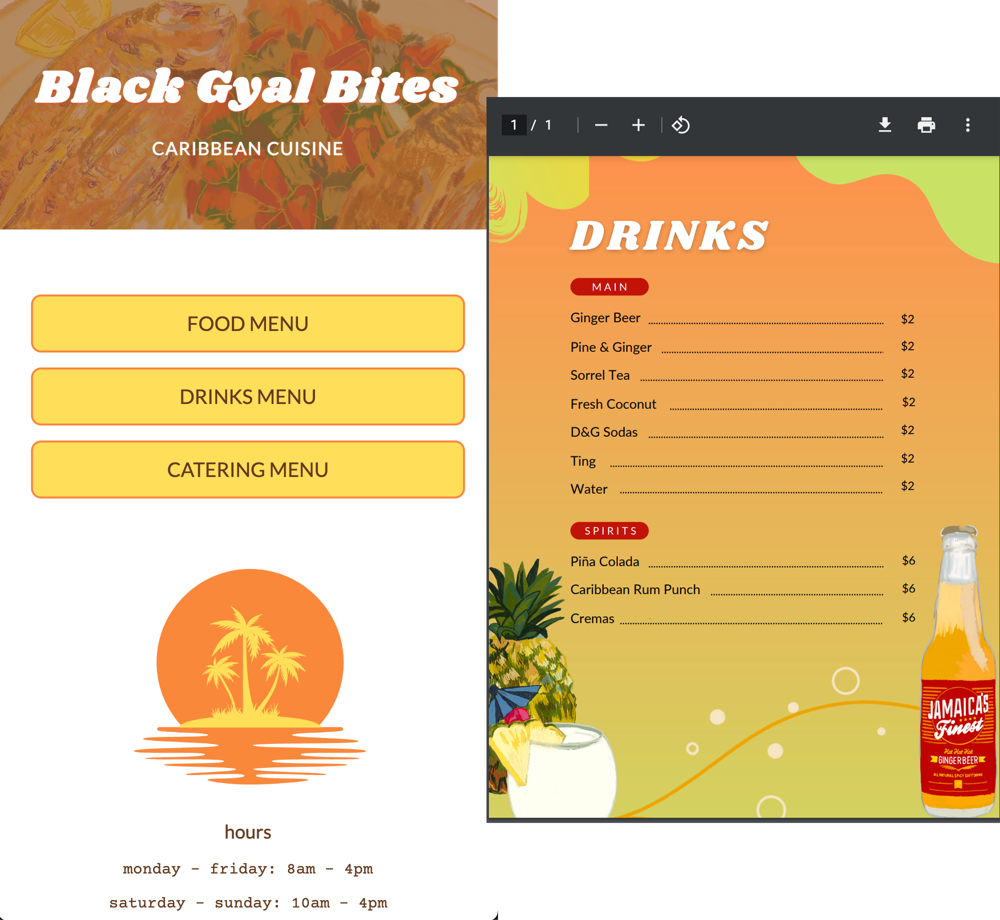

# blackgyalbites

### Template for No-touch Menus
Website built with simple HTML & CSS to display restaurant menus when users scan a QR code.

## Design and Development:
All designs and elements are open source, available for free for anyone to use.

Designed by [The Holistic Technologist](https://holistictech.io)
Illustratios by [Cuoc Doi Prints](https://www.cuocdoiprints.com)

Menu Design Template: [Canva](https://www.canva.com/design/DAFGhaCejFw/zy2w9ZjXJBZ3NssSdfhpTw/view?utm_content=DAFGhaCejFw&utm_campaign=designshare&utm_medium=link2&utm_source=sharebutton)

Download Assets & Design Elements: [Google Drive](https://drive.google.com/drive/u/0/folders/12vHecd82FiiphDGSpwRA8cndsdzDy5QG)

